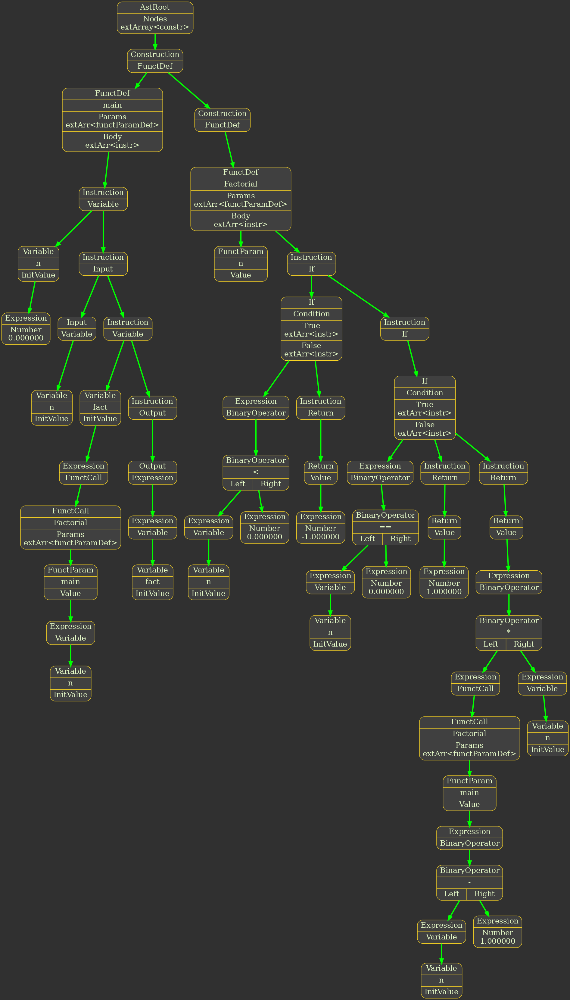

# Language

`Language` - это язык программирования, поддерживающий компиляцию исходного кода для архитектур:
1. Эмулятор процессора SoftCpu
1. Intel x86 (IA-32).

## Содержание

1. [Использование](#использование)
1. [Front-end](#front-end)
1. [AST](#ast)
1. [SoftCpu](#softcpu)
1. [x86](#x86)

## Использование

Склонировать репозиторий:
```
git clone git@github.com:ArtemMaslov/Language.git
```
Перейти в папку проекта:
```
cd Language
```

Проект поддерживает следующие операционные системы: `Windows`, `Linux`.

Проект тестировался на следующих версиях операционных систем `Windows 8.1`, `Ubuntu 22.04.1 LTS`. Безошибочная работа на других версиях не гарантируется.

### Сборка проекта

Проект поддерживает сборку двумя способами с помощью `Microsoft Visual Studio` и `Make`:

1. `Microsoft Visual Studio`.

    1.1. Рекомендуемая версия `Microsoft Visual Studio 2022 Community`. Сборка на других версия `Visual Studio` не проверялась.

    1.2. Необходимо открыть файл решения `./Language.sln`. 
    
    1.3. Выбрать режим сборки `<Build mode>` либо `Debug`, либо `Release`. 

    1.4. Установить архитектуру `<Arch>` `x86`. Проект использует `Jit-компиляцию` для архитектуры `Intel x86`, поэтому исполняемый файл нужно собирать в этой же архитектуре. Если использовать язык только для компиляции под архитектуру `SoftCpu`, то можно выбрать архитектуру сборки `x64`.
    
    1.5. Скомпилировать и скомпоновать проект `Ctrl + Shift + B`. 
    
    1.6. Исполняемый файл будет в папке `./<Arch>/<Build mode>`.

2. `Make`.

    2.1. Рекомендуемая версия не ниже `GNU Make 4.3`.

    2.2. Перейти в папку проекта `./Language` (после выполнения клонирования репозитория команда `cd Language` выполняется дважды. Первая папка `Language` содержит решение (solution), вторая - проект (project)):
    ```
    cd Language
    ```

    2.3. Конфигурационные настройки make находятся в файле `makefile_settings`. Можно изменить архитектуру проекта `PLATFORM`, режим сборки `BUILD_MODE`, операционную систему, на которой будет использоваться проект `TARGET_OS`, имя выходного файла `TARGET_NAME`, флаги компиляции.

    2.4. Выполнить сборку проекта:
    ```
    make
    ```

    2.5. Исполняемый файл будет находиться в папке `./<PLATFORM>/<BUILD_MODE>`.

### Аргументы командной строки

В зависимости от операционной системы, на которой используется проект исполняемый файл может иметь разное расширение `.exe` для Windows и `.out` для Linux. Поэтому далее расширение будет опускаться и компилятор языка будет называться просто `./Language`.

1. Скомпилировать файл `<in_file_name>`. Расширения файла должно быть `.lng`.
```
./Language <in_file_name>
```

2. Указать имя выходного файла:
```
./Language -o <out_file_name>
```

3. Выбрать архитектуру бэкенда:
    3.1. `-iscpu` - для эмулятора SoftCpu.
    3.2. `-ix86` - для Intel x86.
    По умолчанию установлена Intel x86.

4. Вывод различной отладочной информации:
    4.1. `-dump_lex` - вывести информацию о выполнении лексического анализатора в лог-файл.
    4.2. `-dump_ast` - вывести информацию о выполнении синтаксического анализатора в виде графического дерева. Для использования этой опции необходимо установить на компьютер пользователя `GraphViz`.
    4.3. `-list_x86_code` - вывести листинг файл компиляции. Выводить байт-код Intel x86. Только для архитектуры x86.
    4.4. `-list_x86_cmds` - вывести листинг файл компиляции. Выводить ассемблерные команды. Только для архитектуры x86.
    4.5. `-dump_jit` - Вывести скомпонованный байт-код для исполнения. Только для архитектуры x86.

## Front-end

Фронтенд языка похож на упрощенный `C`. Сначала выполняется лексический анализ текста программы. Текст разбивается на лексемы: считываются числа, специальные символы, идентификаторы (имя функций и переменных) сохраняются в специальную таблицу. Затем выполняется синтаксический анализ методом рекурсивного спуска.

Можно выделить следующие особенности синтаксиса языка:

1. Текст программы (имена переменных и функций) пишется на английском языке. Кодировка файла `utf-8` (Можно использовать любую другую, которая использует `ASCII` для кодирования английских букв и специальных символов).

2. В конце инструкции не нужно ставить точку с запятой `;`.

3. Нет типизации данных. Все переменные имеют тип `float` для архитектуры `x86` и `double` для архитектуры `SoftCpu`.

4. Для ввода числа из консоли используется оператор `in`, для вывода данных `out`. После `in` должна стоять переменная. После `out` может стоять вычислимое выражение:
```
in variable
out expression
```

5. При объявлении переменной её необходимо обязательно проинициализировать. Имя переменной или функции может содержать строчные и заглавные английские буквы ('a'-'z', 'A'-'Z'), цифры ('1'-'9') и нижнее подчеркивание '_'. Первым символом не может быть цифра.
```
var_name = init_value
```

6. У операторов цикла `while` и условия `if` обязательно должно быть тело `{ ... }`, даже если оно состоит из одной инструкции. Условное выражение `cond_expr` - это вычислимое выражение, в котором используются операторы сравнения (`==`, `!=`, `>`, `>=`, `<`, `<=`). В условном выражении можно использовать логические операции (`&&`, `||`, `!`).
```
while (cond_expr)
{
    instruction_block
}

if (cond_expr)
{
    instruction_block
}
else (cond_expr)
{
    instruction_block
}
```

7. При объявлении функции не указывается её возвращаемый тип и типы параметров (он всегда является числом с плавающей точкой):
```
funct_name(param1, param2, ..., param_n)
{
    instruction_block
}
```
8. Для возврата значения из функции используется оператор `ret`. Необходимо всегда указывать возвращаемое значение.

Пример программы, находящей факториал числа:
```
main()
{
	n = 0
	
	in n
	
	fact = Factorial(n)
	
	out fact
}

Factorial(n)
{
	if (n < 0)
	{
		ret -1
	}
	
	if (n == 0)
	{
		ret 1
	}
	else
	{
		ret Factorial(n - 1) * n
	}
}
```

## AST

В результате работы лексического и синтаксического анализаторов создаётся абстрактное синтаксическое дерево (АСД), которое является внутренним представлением программы в языке. АСД не является бинарным.

АСД, полученное в результате анализа программы, считающей факториал (нажать на картинку для просмотра в хорошем разрешении):

<p align="center">
    
    <p align="center">Рисунок 1. Графическое представление АСД.</p>
</p>

## SoftCpu

Эмулятор процессора SoftCpu - это программа, которая считывает программы на собственном ассемблере, преобразует в собственный байт-код и исполняет его. [Ссылка на проект](https://github.com/ArtemMaslov/Processor).

Бэкенд языка преобразует АСД в ассемблерный код SoftCpu.

### Встроенные функции

В язык встроенные следующие специальные функции, чтобы поддержать возможности SoftCpu:
1. `sqrt(x)` - извлечь арифметический квадратный корень числа `x`.

1. `set_ram(addr, value)` - записать значение value в оперативную память по адресу addr.

1. `value = get_ram(addr)` - прочитать значение из оперативной памяти по адресу addr.

1. `dsp()` - вывести содержимое видео-памяти в консоль.

1. `int(x)` - отбросить дробную часть числа. Все переменные имеют тип double. Эта команда отбрасывает дробную часть числа и сохраняет полученное целое числа в формате числа с плавающей точкой.

### Некоторые особенности бэкенда SoftCpu
1. Значение из функции возвращается через регистр `ax`.

2. Регистры `bx` и `cx` зарезервированы под создание фреймов функций и не могут использоваться в коде программы. Локальные переменные внутри функции хранятся в оперативной памяти SoftCpu. Регистр `cx` используется для запоминания начального адреса в оперативной памяти при вызове функции. Регистр `bx` используется как указатель на текущую свободную ячейку оперативной памяти. В итоге реализуются стековые фреймы на оперативной памяти, где регистр `bx` выполняет функции `esp` (x86), а регистр `cx` выполняет функции `ebp`. Создание фрейма функции:
```
funct_name:
    push bx
    push cx

    ; cx = bx;
    push bx
    pop cx
    ; Создание фрейма функции завершено

    ; Тело функции

    ; Проинициализировать переменную: присвоить ей начальное значение и выделить память в Ram.
    ; Присвоить значение переменной: 
    pop [cx + var_offset]
    ; Выделение памяти в Ram. bx++;
    push bx
    push 1
    add
    pop bx

    ; Присвоить значение переменной (не инициализация): 
    pop [cx + var_offset]

    ; Получить значение переменной:
    push [cx + var_offset]

    ; Удаление фрейма функции.
    pop cx
    pop bx
    ret
```

3. Проверка логических условий реализуется с помощью сравнения результата условного выражения с 1. Например if транслируется в следующий код на ассемблере:
```
; Сейчас в стеке хранится результат вычисления логического выражения. Он равен либо 0, если выражение ложно, либо 1, если выражение истинно.
push 1
jne l_if_false
    ; Код блока инструкций if.
jmp l_if_end
l_if_false:
    ; Код блока инструкций else
l_if_end:
; Конец оператора if.
```

4. С помощью сохранения результата операции сравнения в стеке в виде логической `1` или `0` реализованы логические операторы `и`, `или`, `не`. Например, код для логического `не` транслируется следующим образом:
```
; Сейчас в стеке хранится результат вычисления логического выражения. Он равен либо 0, если выражение ложно, либо 1, если выражение истинно.
push 0
jne l_not_false
    push 1
    jmp l_not_end
l_not_false:
    push 0
l_not_end:
; Конец оператора `не`.
```

## x86

Бэкенд языка транслирует АСД в байт-код Intel x86 и исполняет его в реальном времени (JIT).

### Встроенные функции

Встроенные функции для архитектуры x86 отличаются от архитектуры SoftCpu.

В язык встроенные следующие специальные функции:
1. `sqrt(x)` - извлечь арифметический квадратный корень числа `x`.

1. `int(x)` - отбросить дробную часть числа. Все переменные имеют тип double. Эта команда отбрасывает дробную часть числа и сохраняет полученное целое числа в формате числа с плавающей точкой.

1. `light()` - выводит в консоль звездочку `*`.

1. `dark()` - выводит в консоль пробел ` `.

### Некоторые особенности бэкенда x86
1. Значение из функции возвращается через регистр `eax`.

2. Арифметические операции реализованы через стек. Сначала операнды (константные числа, значения переменных) записываются в стек (запись в стек осуществляется при появлении операнда в выражении). При выполнении арифметических операций операнды извлекаются из стека, вычисляется результат операции и записывается обратно в стек.

3. При вызове функции создается стековый фрейм:
```
funct_name:
    ; Создание стекового фрейма.
    push ebp
    mov ebp, esp
    ; Выделение <local_vars_size> байт памяти в стеке под локальные переменные
    sub esp, <local_vars_size>
    
    ; Тело функции

    ; Присвоить значение переменной: 
    pop [ebp + var_offset]

    ; Получить значение переменной:
    push [ebp + var_offset]

    ; Возвращение исходного состояния регистра ebp и esp.
    mov esp, ebp
    pop ebp
	ret
```

4. Проверка логических условий реализуется с помощью сравнения результата условного выражения с 1. Например if транслируется в следующий код (ассемблерный код почти не отличается от кода для SoftCpu):
```
; Сейчас в стеке хранится результат вычисления логического выражения. Он равен либо 0, если выражение ложно, либо 1, если выражение истинно.
pop eax
cmp 1, eax
jne l_if_false
    ; Код блока инструкций if.
jmp l_if_end
l_if_false:
    ; Код блока инструкций else
l_if_end:
; Конец оператора if.
```

5. С помощью сохранения результата операции сравнения в стеке в виде логической `1` или `0` реализованы логические операторы `и`, `или`, `не`. Например, код для логического `не` транслируется следующим образом  (ассемблерный код почти не отличается от кода для SoftCpu):
```
; Сейчас в стеке хранится результат вычисления логического выражения. Он равен либо 0, если выражение ложно, либо 1, если выражение истинно.
pop eax
cmp 1, eax
jne l_not_false
    push 1
    jmp l_not_end
l_not_false:
    push 0
l_not_end:
; Конец оператора `не`.
```